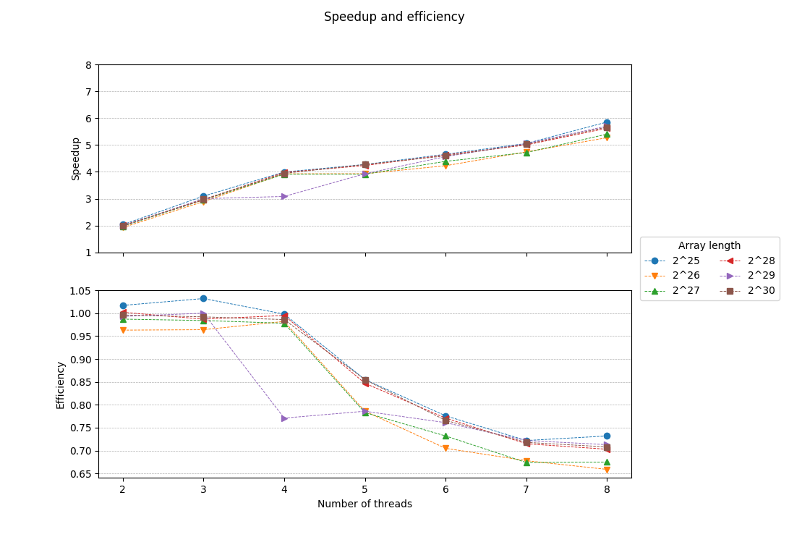

# Project for the High Performance Systems course
## Parallel implementation of the HyperLogLog++ algorithm
### Description
Fills an array of 2^**p** 32-bit unsigned integers with random values and counts the distinct numbers using qsort(). It then approximates this count by using an implementation (without the bias corrections) of the HyperLogLog++ (Heule et al. 2013) algorithm using 64-bit hashes produced by [xxHash](https://github.com/Cyan4973/xxHash).
### Usage
Build with `make`, then `./bin/hll [p [b [s]]]`, where 2^**p** is the length of the array (default: 27 = 134217728 32-bit integers occupying 512MiB), 2^**b** [4..16] the number of 8-bit "registers" the algorithm will use (default: 14 = 16384 registers) and **s** the unsigned integer to seed the RNG used by rand() (default: 1). The count of distinct numbers has been precalculated for **s** = 1 and **p** = [0..30].
### Results - AMD FX-8350 / Debian 4.9.0-6-amd64 / gcc 6.3.0
#### OpenMP / b = 14 (16384 "registers"), s = 1
| Array length | Threads | Time | Speedup | Efficiency | Percent error |
|:------------:|:-------:|:------:|:-------:|:----------:|:-------------:|
| 2^25 | 1 | 1.362 | 1.000 | 1.000 | 0.226 |
| 2^25 | 2 | 0.669 | 2.034 | 1.017 | 0.226 |
| 2^25 | 3 | 0.440 | 3.096 | 1.032 | 0.226 |
| 2^25 | 4 | 0.341 | 3.993 | 0.998 | 0.226 |
| 2^25 | 5 | 0.319 | 4.274 | 0.855 | 0.226 |
| 2^25 | 6 | 0.293 | 4.655 | 0.776 | 0.226 |
| 2^25 | 7 | 0.269 | 5.056 | 0.722 | 0.226 |
| 2^25 | 8 | 0.233 | 5.855 | 0.732 | 0.226 |
| 2^26 | 1 | 2.428 | 1.000 | 1.000 | 0.279 |
| 2^26 | 2 | 1.260 | 1.926 | 0.963 | 0.279 |
| 2^26 | 3 | 0.839 | 2.893 | 0.964 | 0.279 |
| 2^26 | 4 | 0.618 | 3.927 | 0.982 | 0.279 |
| 2^26 | 5 | 0.618 | 3.930 | 0.786 | 0.279 |
| 2^26 | 6 | 0.574 | 4.229 | 0.705 | 0.279 |
| 2^26 | 7 | 0.512 | 4.744 | 0.678 | 0.279 |
| 2^26 | 8 | 0.461 | 5.272 | 0.659 | 0.279 |
| 2^27 | 1 | 4.865 | 1.000 | 1.000 | 0.454 |
| 2^27 | 2 | 2.465 | 1.974 | 0.987 | 0.454 |
| 2^27 | 3 | 1.648 | 2.953 | 0.984 | 0.454 |
| 2^27 | 4 | 1.243 | 3.913 | 0.978 | 0.454 |
| 2^27 | 5 | 1.243 | 3.914 | 0.783 | 0.454 |
| 2^27 | 6 | 1.108 | 4.391 | 0.732 | 0.454 |
| 2^27 | 7 | 1.031 | 4.718 | 0.674 | 0.454 |
| 2^27 | 8 | 0.900 | 5.404 | 0.675 | 0.454 |
| 2^28 | 1 | 9.824 | 1.000 | 1.000 | 1.591 |
| 2^28 | 2 | 4.903 | 2.004 | 1.002 | 1.591 |
| 2^28 | 3 | 3.318 | 2.961 | 0.987 | 1.591 |
| 2^28 | 4 | 2.469 | 3.979 | 0.995 | 1.591 |
| 2^28 | 5 | 2.320 | 4.235 | 0.847 | 1.591 |
| 2^28 | 6 | 2.122 | 4.629 | 0.771 | 1.591 |
| 2^28 | 7 | 1.964 | 5.002 | 0.715 | 1.591 |
| 2^28 | 8 | 1.746 | 5.626 | 0.703 | 1.591 |
| 2^29 | 1 | 19.617 | 1.000 | 1.000 | 0.534 |
| 2^29 | 2 | 9.880 | 1.986 | 0.993 | 0.534 |
| 2^29 | 3 | 6.540 | 3.000 | 1.000 | 0.534 |
| 2^29 | 4 | 6.362 | 3.084 | 0.771 | 0.534 |
| 2^29 | 5 | 4.994 | 3.928 | 0.786 | 0.534 |
| 2^29 | 6 | 4.295 | 4.568 | 0.761 | 0.534 |
| 2^29 | 7 | 3.883 | 5.052 | 0.722 | 0.534 |
| 2^29 | 8 | 3.439 | 5.704 | 0.713 | 0.534 |
| 2^30 | 1 | 39.157 | 1.000 | 1.000 | 0.647 |
| 2^30 | 2 | 19.659 | 1.992 | 0.996 | 0.647 |
| 2^30 | 3 | 13.153 | 2.977 | 0.992 | 0.647 |
| 2^30 | 4 | 9.929 | 3.944 | 0.986 | 0.647 |
| 2^30 | 5 | 9.164 | 4.273 | 0.855 | 0.647 |
| 2^30 | 6 | 8.524 | 4.594 | 0.766 | 0.647 |
| 2^30 | 7 | 7.788 | 5.028 | 0.718 | 0.647 |
| 2^30 | 8 | 6.912 | 5.665 | 0.708 | 0.647 |

### References
* [“HyperLogLog.” Wikipedia, April 3, 2018.](https://en.wikipedia.org/w/index.php?title=HyperLogLog&oldid=833994784)
* [Bozkus, Cem, and Basilio B. Fraguela. “Accelerating the HyperLogLog Cardinality Estimation Algorithm.” Scientific Programming 2017 (2017): 1–8. https://doi.org/10.1155/2017/2040865.
](biblio/2040865.pdf)
* [K. Kumar and S. Subash, “Approximate large multiset cardinality using map reduce,” Tech. Rep., Rochester Institute Of Technology, 2015.](biblio/report.pdf)
* [Heule, Stefan, Marc Nunkesser, and Alexander Hall. “HyperLogLog in Practice: Algorithmic Engineering of a State of the Art Cardinality Estimation Algorithm.” In Proceedings of the 16th International Conference on Extending Database Technology, 683–692. ACM, 2013.
](biblio/p683-heule.pdf)
* [Flajolet, Philippe, Éric Fusy, Olivier Gandouet, and Frédéric Meunier. “Hyperloglog: The Analysis of a near-Optimal Cardinality Estimation Algorithm.” In AofA: Analysis of Algorithms, 137–156. Discrete Mathematics and Theoretical Computer Science, 2007.
](biblio/FlFuGaMe07.pdf)
* [Collet, Yann. xxHash: Extremely Fast Non-Cryptographic Hash Algorithm. C, 2018.](https://github.com/Cyan4973/xxHash)
