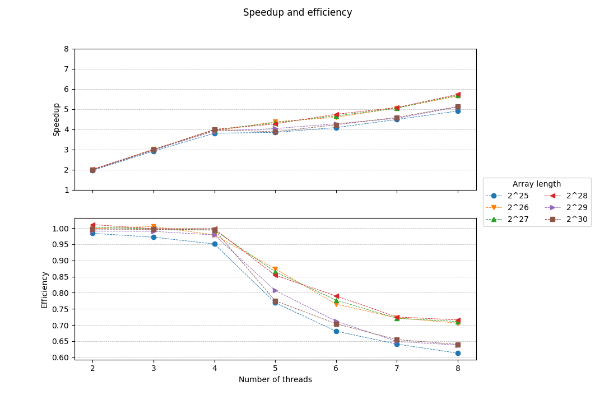

# Parallel implementation of the HyperLogLog++ algorithm
## Description
Fills an array of 2^p 32-bit unsigned integers with random values and counts the distinct numbers using qsort(). It then approximates this count by using an implementation (without the bias corrections) of the HyperLogLog++ algorithm (Heule et al. 2013) using 64-bit hashes produced by [xxHash](https://github.com/Cyan4973/xxHash).
## Usage
Build with `make`, then `./bin/hll [p [b [s]]]`, where 2^**p** is the length of the array (default: 27 = 134217728 32-bit integers occupying 512MiB), 2^**b** [4..16] the number of 8-bit "registers" the algorithm will use (default: 14 = 16384 registers) and **s** the unsigned integer to seed the RNG used by rand() (default: 1). The count of distinct numbers has been precalculated for **s** = 1 and **p** = [0..30].
## Results 
### OpenMP - AMD FX-8350 4.0GHz / Debian 4.9.0-6-amd64 / gcc 6.3.0 (with -O3 optimizations)
Options used: b = 14 (16384 registers), s = 1

Time values were calculated as the interquartile mean (IQM) of the timings taken from 20 runs for each array length.

| Array length | Threads | Time | Speedup | Efficiency | Percent error |
|:------------:|:-------:|:------:|:-------:|:----------:|:-------------:|
| 2^25 | 1 | 1.220 | 1.000 | 1.000 | 0.226 |
| 2^25 | 2 | 0.620 | 1.968 | 0.984 | 0.226 |
| 2^25 | 3 | 0.418 | 2.916 | 0.972 | 0.226 |
| 2^25 | 4 | 0.321 | 3.805 | 0.951 | 0.226 |
| 2^25 | 5 | 0.317 | 3.846 | 0.769 | 0.226 |
| 2^25 | 6 | 0.299 | 4.086 | 0.681 | 0.226 |
| 2^25 | 7 | 0.272 | 4.484 | 0.641 | 0.226 |
| 2^25 | 8 | 0.249 | 4.904 | 0.613 | 0.226 |
| 2^26 | 1 | 2.746 | 1.000 | 1.000 | 0.279 |
| 2^26 | 2 | 1.374 | 1.999 | 0.999 | 0.279 |
| 2^26 | 3 | 0.911 | 3.015 | 1.005 | 0.279 |
| 2^26 | 4 | 0.701 | 3.916 | 0.979 | 0.279 |
| 2^26 | 5 | 0.628 | 4.372 | 0.874 | 0.279 |
| 2^26 | 6 | 0.598 | 4.592 | 0.765 | 0.279 |
| 2^26 | 7 | 0.543 | 5.056 | 0.722 | 0.279 |
| 2^26 | 8 | 0.486 | 5.647 | 0.706 | 0.279 |
| 2^27 | 1 | 5.486 | 1.000 | 1.000 | 0.454 |
| 2^27 | 2 | 2.736 | 2.005 | 1.003 | 0.454 |
| 2^27 | 3 | 1.833 | 2.993 | 0.998 | 0.454 |
| 2^27 | 4 | 1.380 | 3.977 | 0.994 | 0.454 |
| 2^27 | 5 | 1.268 | 4.327 | 0.865 | 0.454 |
| 2^27 | 6 | 1.177 | 4.662 | 0.777 | 0.454 |
| 2^27 | 7 | 1.087 | 5.047 | 0.721 | 0.454 |
| 2^27 | 8 | 0.964 | 5.689 | 0.711 | 0.454 |
| 2^28 | 1 | 10.986 | 1.000 | 1.000 | 1.591 |
| 2^28 | 2 | 5.434 | 2.022 | 1.011 | 1.591 |
| 2^28 | 3 | 3.671 | 2.993 | 0.998 | 1.591 |
| 2^28 | 4 | 2.753 | 3.991 | 0.998 | 1.591 |
| 2^28 | 5 | 2.573 | 4.269 | 0.854 | 1.591 |
| 2^28 | 6 | 2.317 | 4.742 | 0.790 | 1.591 |
| 2^28 | 7 | 2.163 | 5.078 | 0.725 | 1.591 |
| 2^28 | 8 | 1.918 | 5.729 | 0.716 | 1.591 |
| 2^29 | 1 | 19.442 | 1.000 | 1.000 | 0.534 |
| 2^29 | 2 | 9.808 | 1.982 | 0.991 | 0.534 |
| 2^29 | 3 | 6.548 | 2.969 | 0.990 | 0.534 |
| 2^29 | 4 | 4.966 | 3.915 | 0.979 | 0.534 |
| 2^29 | 5 | 4.818 | 4.035 | 0.807 | 0.534 |
| 2^29 | 6 | 4.550 | 4.273 | 0.712 | 0.534 |
| 2^29 | 7 | 4.280 | 4.543 | 0.649 | 0.534 |
| 2^29 | 8 | 3.807 | 5.107 | 0.638 | 0.534 |
| 2^30 | 1 | 38.799 | 1.000 | 1.000 | 0.647 |
| 2^30 | 2 | 19.456 | 1.994 | 0.997 | 0.647 |
| 2^30 | 3 | 12.980 | 2.989 | 0.996 | 0.647 |
| 2^30 | 4 | 9.749 | 3.980 | 0.995 | 0.647 |
| 2^30 | 5 | 10.009 | 3.877 | 0.775 | 0.647 |
| 2^30 | 6 | 9.185 | 4.224 | 0.704 | 0.647 |
| 2^30 | 7 | 8.456 | 4.588 | 0.655 | 0.647 |
| 2^30 | 8 | 7.576 | 5.122 | 0.640 | 0.647 |

## References
* [“HyperLogLog.” Wikipedia, April 3, 2018.](https://en.wikipedia.org/w/index.php?title=HyperLogLog&oldid=833994784)
* [Bozkus, Cem, and Basilio B. Fraguela. “Accelerating the HyperLogLog Cardinality Estimation Algorithm.” Scientific Programming 2017 (2017): 1–8. https://doi.org/10.1155/2017/2040865.
](biblio/2040865.pdf)
* [K. Kumar and S. Subash, “Approximate large multiset cardinality using map reduce,” Tech. Rep., Rochester Institute Of Technology, 2015.](biblio/report.pdf)
* [Heule, Stefan, Marc Nunkesser, and Alexander Hall. “HyperLogLog in Practice: Algorithmic Engineering of a State of the Art Cardinality Estimation Algorithm.” In Proceedings of the 16th International Conference on Extending Database Technology, 683–692. ACM, 2013.
](biblio/p683-heule.pdf)
* [Flajolet, Philippe, Éric Fusy, Olivier Gandouet, and Frédéric Meunier. “Hyperloglog: The Analysis of a near-Optimal Cardinality Estimation Algorithm.” In AofA: Analysis of Algorithms, 137–156. Discrete Mathematics and Theoretical Computer Science, 2007.
](biblio/FlFuGaMe07.pdf)
* [Collet, Yann. xxHash: Extremely Fast Non-Cryptographic Hash Algorithm. C, 2018.](https://github.com/Cyan4973/xxHash)
