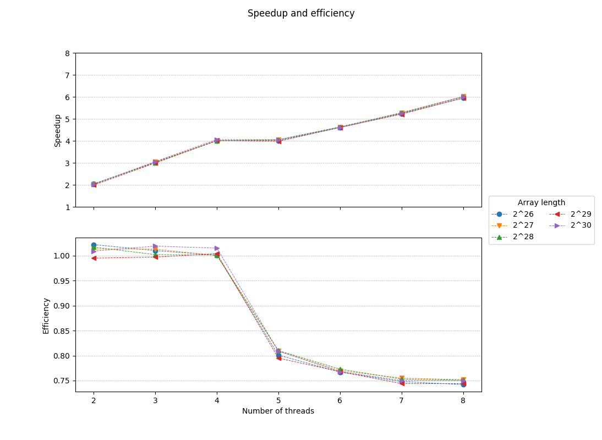

# Parallel implementation of the HyperLogLog++ algorithm
## Description
Fills an array of 2^p 32-bit unsigned integers with random values and counts the distinct numbers using qsort(). It then approximates this count by using an implementation (without the bias corrections) of the HyperLogLog++ algorithm (Heule et al. 2013) using 64-bit hashes produced by [xxHash](https://github.com/Cyan4973/xxHash).
## Usage
Build with `make`, then `./bin/hll [p [b [s]]]`, where 2^**p** is the length of the array (default: 27 = 134217728 32-bit integers occupying 512MiB), 2^**b** [4..16] the number of 8-bit "registers" the algorithm will use (default: 14 = 16384 registers) and **s** the unsigned integer to seed the RNG used by rand() (default: 1). The count of distinct numbers has been precalculated for **s** = 1 and **p** = [0..30].
## Results 
### OpenMP - AMD FX-8350 4.0GHz / Xubuntu 16.04 64bit / gcc 5.4.0 (with -O3 optimizations)
Options used: b = 14 (16384 registers), s = 1

Time values were calculated as the interquartile mean (IQM) of the timings taken from 20 runs for each array length.

| Array length | Threads | Time | Speedup | Efficiency | Percent error |
|--------------|---------|--------|---------|------------|---------------|
| 2^25 | 1 | 1.340 | 1.000 | 1.000 | 0.226 |
| 2^25 | 2 | 0.659 | 2.035 | 1.018 | 0.226 |
| 2^25 | 3 | 0.441 | 3.042 | 1.014 | 0.226 |
| 2^25 | 4 | 0.332 | 4.033 | 1.008 | 0.226 |
| 2^25 | 5 | 0.329 | 4.072 | 0.814 | 0.226 |
| 2^25 | 6 | 0.285 | 4.701 | 0.783 | 0.226 |
| 2^25 | 7 | 0.254 | 5.269 | 0.753 | 0.226 |
| 2^25 | 8 | 0.223 | 6.007 | 0.751 | 0.226 |
| 2^26 | 1 | 2.716 | 1.000 | 1.000 | 0.279 |
| 2^26 | 2 | 1.343 | 2.023 | 1.011 | 0.279 |
| 2^26 | 3 | 0.898 | 3.026 | 1.009 | 0.279 |
| 2^26 | 4 | 0.663 | 4.098 | 1.024 | 0.279 |
| 2^26 | 5 | 0.645 | 4.210 | 0.842 | 0.279 |
| 2^26 | 6 | 0.562 | 4.837 | 0.806 | 0.279 |
| 2^26 | 7 | 0.496 | 5.480 | 0.783 | 0.279 |
| 2^26 | 8 | 0.442 | 6.152 | 0.769 | 0.279 |
| 2^27 | 1 | 5.427 | 1.000 | 1.000 | 0.454 |
| 2^27 | 2 | 2.706 | 2.006 | 1.003 | 0.454 |
| 2^27 | 3 | 1.798 | 3.019 | 1.006 | 0.454 |
| 2^27 | 4 | 1.338 | 4.055 | 1.014 | 0.454 |
| 2^27 | 5 | 1.289 | 4.210 | 0.842 | 0.454 |
| 2^27 | 6 | 1.114 | 4.873 | 0.812 | 0.454 |
| 2^27 | 7 | 0.980 | 5.536 | 0.791 | 0.454 |
| 2^27 | 8 | 0.862 | 6.294 | 0.787 | 0.454 |
| 2^28 | 1 | 10.824 | 1.000 | 1.000 | 1.591 |
| 2^28 | 2 | 5.375 | 2.014 | 1.007 | 1.591 |
| 2^28 | 3 | 3.606 | 3.002 | 1.001 | 1.591 |
| 2^28 | 4 | 2.687 | 4.028 | 1.007 | 1.591 |
| 2^28 | 5 | 2.563 | 4.223 | 0.845 | 1.591 |
| 2^28 | 6 | 2.219 | 4.878 | 0.813 | 1.591 |
| 2^28 | 7 | 1.998 | 5.417 | 0.774 | 1.591 |
| 2^28 | 8 | 1.731 | 6.253 | 0.782 | 1.591 |
| 2^29 | 1 | 21.647 | 1.000 | 1.000 | 0.534 |
| 2^29 | 2 | 10.845 | 1.996 | 0.998 | 0.534 |
| 2^29 | 3 | 7.228 | 2.995 | 0.998 | 0.534 |
| 2^29 | 4 | 5.380 | 4.024 | 1.006 | 0.534 |
| 2^29 | 5 | 5.142 | 4.210 | 0.842 | 0.534 |
| 2^29 | 6 | 4.440 | 4.875 | 0.813 | 0.534 |
| 2^29 | 7 | 3.894 | 5.559 | 0.794 | 0.534 |
| 2^29 | 8 | 3.486 | 6.209 | 0.776 | 0.534 |
| 2^30 | 1 | 43.311 | 1.000 | 1.000 | 0.647 |
| 2^30 | 2 | 21.459 | 2.018 | 1.009 | 0.647 |
| 2^30 | 3 | 14.324 | 3.024 | 1.008 | 0.647 |
| 2^30 | 4 | 10.852 | 3.991 | 0.998 | 0.647 |
| 2^30 | 5 | 10.302 | 4.204 | 0.841 | 0.647 |
| 2^30 | 6 | 8.905 | 4.864 | 0.811 | 0.647 |
| 2^30 | 7 | 7.755 | 5.585 | 0.798 | 0.647 |
| 2^30 | 8 | 6.783 | 6.385 | 0.798 | 0.647 |

## References
* [“HyperLogLog.” Wikipedia, April 3, 2018.](https://en.wikipedia.org/w/index.php?title=HyperLogLog&oldid=833994784)
* [Bozkus, Cem, and Basilio B. Fraguela. “Accelerating the HyperLogLog Cardinality Estimation Algorithm.” Scientific Programming 2017 (2017): 1–8. https://doi.org/10.1155/2017/2040865.
](biblio/2040865.pdf)
* [K. Kumar and S. Subash, “Approximate large multiset cardinality using map reduce,” Tech. Rep., Rochester Institute Of Technology, 2015.](biblio/report.pdf)
* [Heule, Stefan, Marc Nunkesser, and Alexander Hall. “HyperLogLog in Practice: Algorithmic Engineering of a State of the Art Cardinality Estimation Algorithm.” In Proceedings of the 16th International Conference on Extending Database Technology, 683–692. ACM, 2013.
](biblio/p683-heule.pdf)
* [Flajolet, Philippe, Éric Fusy, Olivier Gandouet, and Frédéric Meunier. “Hyperloglog: The Analysis of a near-Optimal Cardinality Estimation Algorithm.” In AofA: Analysis of Algorithms, 137–156. Discrete Mathematics and Theoretical Computer Science, 2007.
](biblio/FlFuGaMe07.pdf)
* [Collet, Yann. xxHash: Extremely Fast Non-Cryptographic Hash Algorithm. C, 2018.](https://github.com/Cyan4973/xxHash)
