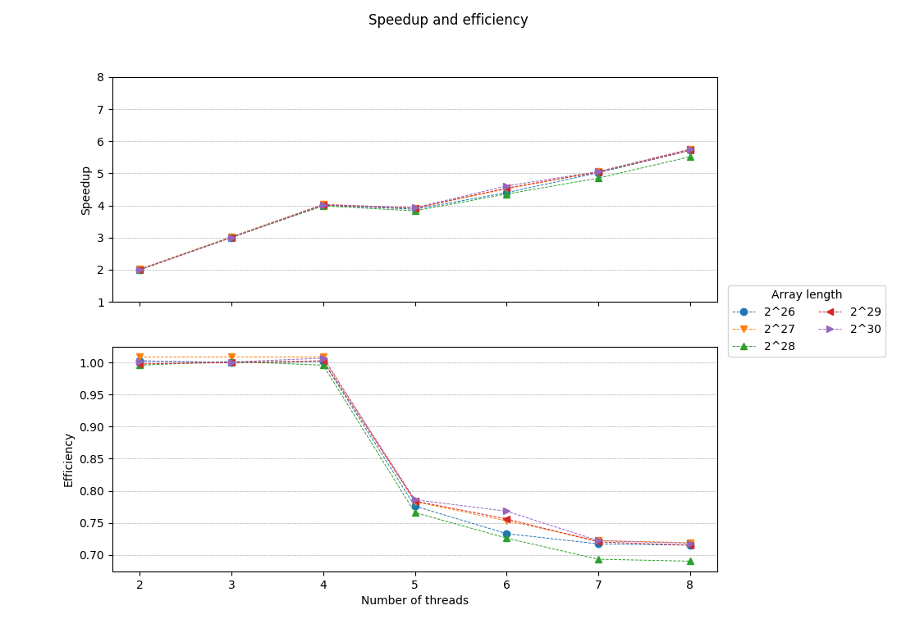

# Parallel implementation of the HyperLogLog++ algorithm
## Description
Fills an array of 32-bit unsigned integers with random values (about 78% of them are distinct). It then approximates their precalculated distinct count by using an implementation of the HyperLogLog++ algorithm (Heule et al. 2013) (without the bias corrections) using 64-bit hashes produced by [xxHash](https://github.com/Cyan4973/xxHash).
## Usage
Build with `make` then `./bin/hllpp_omp [-p ...] [-b ...] [-u ...] [-r ...] [-t ...]`

, where:
* 2^**p** is the length of the array (default: 27 = 134217728 32-bit integers occupying 512MiB) 
* 2^**b** [4..16] the number of 8-bit "registers" the algorithm will use (default: 14 = 16384 registers)
* **u** is the size of the buffer in MiBs that will be used (default: 256)
* **r** the number of times the algorithm will run (default: 1)
* **t** the specific number of threads to be used (default: 0 = 1 up to omp_get_num_procs() threads)

The count of distinct numbers has been precalculated for **p** = 0 up to 30.
## Results 
### OpenMP - AMD FX-8350 4.0GHz / Xubuntu 16.04 64bit / gcc 5.4.0 (with -O3 optimizations)
Options used: b = 14 (16384 registers)

Time values were calculated as the interquartile mean (IQM) of the timings taken from 20 runs for each array length.

| Array length | Threads | Time | Speedup | Efficiency | Percent error |
|:------------:|:-------:|:------:|:-------:|:----------:|:-------------:|
| 2^26 | 1 | 2.568 | 1.000 | 1.000 | 0.279 |
| 2^26 | 2 | 1.256 | 2.045 | 1.022 | 0.279 |
| 2^26 | 3 | 0.847 | 3.031 | 1.010 | 0.279 |
| 2^26 | 4 | 0.641 | 4.005 | 1.001 | 0.279 |
| 2^26 | 5 | 0.641 | 4.006 | 0.801 | 0.279 |
| 2^26 | 6 | 0.558 | 4.600 | 0.767 | 0.279 |
| 2^26 | 7 | 0.490 | 5.236 | 0.748 | 0.279 |
| 2^26 | 8 | 0.432 | 5.938 | 0.742 | 0.279 |
| 2^27 | 1 | 5.165 | 1.000 | 1.000 | 0.454 |
| 2^27 | 2 | 2.548 | 2.027 | 1.013 | 0.454 |
| 2^27 | 3 | 1.699 | 3.039 | 1.013 | 0.454 |
| 2^27 | 4 | 1.291 | 4.000 | 1.000 | 0.454 |
| 2^27 | 5 | 1.277 | 4.046 | 0.809 | 0.454 |
| 2^27 | 6 | 1.118 | 4.619 | 0.770 | 0.454 |
| 2^27 | 7 | 0.978 | 5.283 | 0.755 | 0.454 |
| 2^27 | 8 | 0.859 | 6.015 | 0.752 | 0.454 |
| 2^28 | 1 | 10.273 | 1.000 | 1.000 | 1.591 |
| 2^28 | 2 | 5.050 | 2.034 | 1.017 | 1.591 |
| 2^28 | 3 | 3.417 | 3.007 | 1.002 | 1.591 |
| 2^28 | 4 | 2.566 | 4.003 | 1.001 | 1.591 |
| 2^28 | 5 | 2.537 | 4.050 | 0.810 | 1.591 |
| 2^28 | 6 | 2.215 | 4.637 | 0.773 | 1.591 |
| 2^28 | 7 | 1.950 | 5.269 | 0.753 | 1.591 |
| 2^28 | 8 | 1.711 | 6.004 | 0.751 | 1.591 |
| 2^29 | 1 | 20.320 | 1.000 | 1.000 | 0.534 |
| 2^29 | 2 | 10.216 | 1.989 | 0.995 | 0.534 |
| 2^29 | 3 | 6.794 | 2.991 | 0.997 | 0.534 |
| 2^29 | 4 | 5.058 | 4.017 | 1.004 | 0.534 |
| 2^29 | 5 | 5.109 | 3.977 | 0.795 | 0.534 |
| 2^29 | 6 | 4.408 | 4.610 | 0.768 | 0.534 |
| 2^29 | 7 | 3.899 | 5.211 | 0.744 | 0.534 |
| 2^29 | 8 | 3.414 | 5.951 | 0.744 | 0.534 |
| 2^30 | 1 | 40.947 | 1.000 | 1.000 | 0.647 |
| 2^30 | 2 | 20.281 | 2.019 | 1.009 | 0.647 |
| 2^30 | 3 | 13.391 | 3.058 | 1.019 | 0.647 |
| 2^30 | 4 | 10.085 | 4.060 | 1.015 | 0.647 |
| 2^30 | 5 | 10.118 | 4.047 | 0.809 | 0.647 |
| 2^30 | 6 | 8.888 | 4.607 | 0.768 | 0.647 |
| 2^30 | 7 | 7.794 | 5.253 | 0.750 | 0.647 |
| 2^30 | 8 | 6.822 | 6.003 | 0.750 | 0.647 |

## References
* [“HyperLogLog.” Wikipedia, April 3, 2018.](https://en.wikipedia.org/w/index.php?title=HyperLogLog&oldid=833994784)
* [Bozkus, Cem, and Basilio B. Fraguela. “Accelerating the HyperLogLog Cardinality Estimation Algorithm.” Scientific Programming 2017 (2017): 1–8. https://doi.org/10.1155/2017/2040865.
](biblio/2040865.pdf)
* [K. Kumar and S. Subash, “Approximate large multiset cardinality using map reduce,” Tech. Rep., Rochester Institute Of Technology, 2015.](biblio/report.pdf)
* [Heule, Stefan, Marc Nunkesser, and Alexander Hall. “HyperLogLog in Practice: Algorithmic Engineering of a State of the Art Cardinality Estimation Algorithm.” In Proceedings of the 16th International Conference on Extending Database Technology, 683–692. ACM, 2013.
](biblio/p683-heule.pdf)
* [Flajolet, Philippe, Éric Fusy, Olivier Gandouet, and Frédéric Meunier. “Hyperloglog: The Analysis of a near-Optimal Cardinality Estimation Algorithm.” In AofA: Analysis of Algorithms, 137–156. Discrete Mathematics and Theoretical Computer Science, 2007.
](biblio/FlFuGaMe07.pdf)
* [Collet, Yann. xxHash: Extremely Fast Non-Cryptographic Hash Algorithm. C, 2018.](https://github.com/Cyan4973/xxHash)
