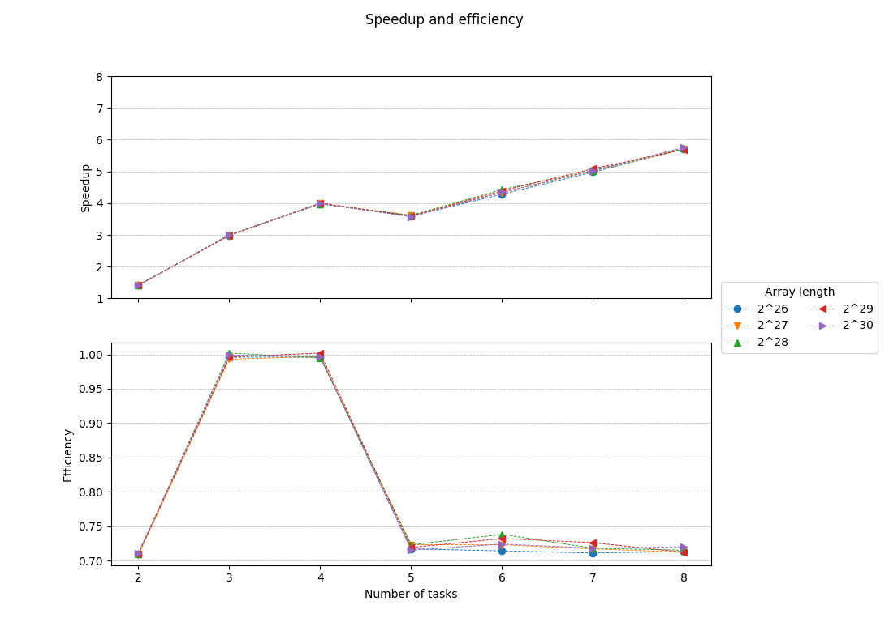

# Parallel implementation of the HyperLogLog++ algorithm using OpenMP and Open MPI
## Description
The program fills an array of 32-bit unsigned integers with random values (about 78% of them are distinct). It then approximates their precalculated distinct count by using an implementation of the HyperLogLog++ algorithm (Heule et al. 2013) (without the bias corrections) using 64-bit hashes produced by [xxHash](https://github.com/Cyan4973/xxHash).
## Usage
Build with `make` then 
* for OpenMP: `./bin/hllpp_omp [-p <val>] [-b <val>] [-u <val>] [-r <val>] [-t <val>]`
* for Open MPI: `mpiexec [-n <val>] ./bin/hllpp_mpi [-p <val>] [-b <val>] [-u <val>] [-r <val>] `

, where:
* 2^**p** is the length of the array (default: 27 = 134217728 32-bit integers occupying 512 MiB) 
* 2^**b** [4..16] is the number of 8-bit "registers" the algorithm will use (default: 14 = 16384 registers)
* **u** is the size of the buffer in MiBs that will be used (default: 256)
* **r** is the number of times the algorithm will run (default: 1)
* (OpenMP) **t** is the specific number of threads to be used (default: 0 = 1 up to omp_get_num_procs() threads)
* (Open MPI) **n** is the specific number of processes to be used (default: number of processes that can usefully be started)

The count of distinct numbers has been precalculated for **p** = 0 up to 30.
## Results 
AMD FX-8350 4.0GHz / Xubuntu 16.04 64bit / gcc 5.4.0 (with -O3 optimizations)

Options used: **p** = [26..30], **b** = 14, **u** = 4096, **r** = 20

Time values were calculated as the interquartile mean (IQM) of the timings taken from 20 runs for each array length.

### OpenMP

| Array length | Threads | Time | Speedup | Efficiency | Percent error |
|:------------:|:-------:|:------:|:-------:|:----------:|:-------------:|
| 2^26 | 1 | 2.510 | 1.000 | 1.000 | 0.279 |
| 2^26 | 2 | 1.251 | 2.006 | 1.003 | 0.279 |
| 2^26 | 3 | 0.836 | 3.001 | 1.000 | 0.279 |
| 2^26 | 4 | 0.626 | 4.010 | 1.002 | 0.279 |
| 2^26 | 5 | 0.647 | 3.882 | 0.776 | 0.279 |
| 2^26 | 6 | 0.570 | 4.401 | 0.733 | 0.279 |
| 2^26 | 7 | 0.500 | 5.017 | 0.717 | 0.279 |
| 2^26 | 8 | 0.439 | 5.716 | 0.715 | 0.279 |
| 2^27 | 1 | 5.031 | 1.000 | 1.000 | 0.454 |
| 2^27 | 2 | 2.493 | 2.018 | 1.009 | 0.454 |
| 2^27 | 3 | 1.662 | 3.026 | 1.009 | 0.454 |
| 2^27 | 4 | 1.247 | 4.036 | 1.009 | 0.454 |
| 2^27 | 5 | 1.285 | 3.914 | 0.783 | 0.454 |
| 2^27 | 6 | 1.113 | 4.519 | 0.753 | 0.454 |
| 2^27 | 7 | 0.995 | 5.055 | 0.722 | 0.454 |
| 2^27 | 8 | 0.874 | 5.754 | 0.719 | 0.454 |
| 2^28 | 1 | 9.929 | 1.000 | 1.000 | 1.591 |
| 2^28 | 2 | 4.984 | 1.992 | 0.996 | 1.591 |
| 2^28 | 3 | 3.302 | 3.007 | 1.002 | 1.591 |
| 2^28 | 4 | 2.492 | 3.985 | 0.996 | 1.591 |
| 2^28 | 5 | 2.591 | 3.832 | 0.766 | 1.591 |
| 2^28 | 6 | 2.279 | 4.356 | 0.726 | 1.591 |
| 2^28 | 7 | 2.047 | 4.851 | 0.693 | 1.591 |
| 2^28 | 8 | 1.799 | 5.519 | 0.690 | 1.591 |
| 2^29 | 1 | 19.874 | 1.000 | 1.000 | 0.534 |
| 2^29 | 2 | 9.961 | 1.995 | 0.998 | 0.534 |
| 2^29 | 3 | 6.628 | 2.999 | 1.000 | 0.534 |
| 2^29 | 4 | 4.955 | 4.011 | 1.003 | 0.534 |
| 2^29 | 5 | 5.071 | 3.919 | 0.784 | 0.534 |
| 2^29 | 6 | 4.379 | 4.539 | 0.756 | 0.534 |
| 2^29 | 7 | 3.944 | 5.039 | 0.720 | 0.534 |
| 2^29 | 8 | 3.476 | 5.718 | 0.715 | 0.534 |
| 2^30 | 1 | 39.931 | 1.000 | 1.000 | 0.647 |
| 2^30 | 2 | 19.926 | 2.004 | 1.002 | 0.647 |
| 2^30 | 3 | 13.298 | 3.003 | 1.001 | 0.647 |
| 2^30 | 4 | 9.918 | 4.026 | 1.007 | 0.647 |
| 2^30 | 5 | 10.163 | 3.929 | 0.786 | 0.647 |
| 2^30 | 6 | 8.664 | 4.609 | 0.768 | 0.647 |
| 2^30 | 7 | 7.900 | 5.055 | 0.722 | 0.647 |
| 2^30 | 8 | 6.949 | 5.747 | 0.718 | 0.647 |

### Open MPI

| Array length | Tasks | Time | Speedup | Efficiency | Percent error |
|:------------:|:-----:|:------:|:-------:|:----------:|:-------------:|
| 2^26 | 1 | 2.442 | 1.000 | 1.000 | 0.279 |
| 2^26 | 2 | 1.720 | 1.419 | 0.710 | 0.279 |
| 2^26 | 3 | 0.817 | 2.989 | 0.996 | 0.279 |
| 2^26 | 4 | 0.613 | 3.983 | 0.996 | 0.279 |
| 2^26 | 5 | 0.681 | 3.586 | 0.717 | 0.279 |
| 2^26 | 6 | 0.570 | 4.284 | 0.714 | 0.279 |
| 2^26 | 7 | 0.490 | 4.980 | 0.711 | 0.279 |
| 2^26 | 8 | 0.428 | 5.707 | 0.713 | 0.279 |
| 2^27 | 1 | 4.870 | 1.000 | 1.000 | 0.454 |
| 2^27 | 2 | 3.439 | 1.416 | 0.708 | 0.454 |
| 2^27 | 3 | 1.635 | 2.979 | 0.993 | 0.454 |
| 2^27 | 4 | 1.221 | 3.989 | 0.997 | 0.454 |
| 2^27 | 5 | 1.346 | 3.617 | 0.723 | 0.454 |
| 2^27 | 6 | 1.123 | 4.337 | 0.723 | 0.454 |
| 2^27 | 7 | 0.971 | 5.017 | 0.717 | 0.454 |
| 2^27 | 8 | 0.855 | 5.698 | 0.712 | 0.454 |
| 2^28 | 1 | 9.767 | 1.000 | 1.000 | 1.591 |
| 2^28 | 2 | 6.876 | 1.420 | 0.710 | 1.591 |
| 2^28 | 3 | 3.248 | 3.007 | 1.002 | 1.591 |
| 2^28 | 4 | 2.455 | 3.979 | 0.995 | 1.591 |
| 2^28 | 5 | 2.701 | 3.616 | 0.723 | 1.591 |
| 2^28 | 6 | 2.205 | 4.429 | 0.738 | 1.591 |
| 2^28 | 7 | 1.943 | 5.027 | 0.718 | 1.591 |
| 2^28 | 8 | 1.708 | 5.719 | 0.715 | 1.591 |
| 2^29 | 1 | 19.536 | 1.000 | 1.000 | 0.534 |
| 2^29 | 2 | 13.752 | 1.421 | 0.710 | 0.534 |
| 2^29 | 3 | 6.539 | 2.988 | 0.996 | 0.534 |
| 2^29 | 4 | 4.875 | 4.007 | 1.002 | 0.534 |
| 2^29 | 5 | 5.436 | 3.594 | 0.719 | 0.534 |
| 2^29 | 6 | 4.448 | 4.392 | 0.732 | 0.534 |
| 2^29 | 7 | 3.842 | 5.085 | 0.726 | 0.534 |
| 2^29 | 8 | 3.432 | 5.692 | 0.712 | 0.534 |
| 2^30 | 1 | 39.113 | 1.000 | 1.000 | 0.647 |
| 2^30 | 2 | 27.501 | 1.422 | 0.711 | 0.647 |
| 2^30 | 3 | 13.045 | 2.998 | 0.999 | 0.647 |
| 2^30 | 4 | 9.806 | 3.989 | 0.997 | 0.647 |
| 2^30 | 5 | 10.945 | 3.574 | 0.715 | 0.647 |
| 2^30 | 6 | 9.005 | 4.344 | 0.724 | 0.647 |
| 2^30 | 7 | 7.783 | 5.026 | 0.718 | 0.647 |
| 2^30 | 8 | 6.794 | 5.757 | 0.720 | 0.647 |

## References
* [“HyperLogLog.” Wikipedia, April 3, 2018.](https://en.wikipedia.org/w/index.php?title=HyperLogLog&oldid=833994784)
* [Bozkus, Cem, and Basilio B. Fraguela. “Accelerating the HyperLogLog Cardinality Estimation Algorithm.” Scientific Programming 2017 (2017): 1–8. https://doi.org/10.1155/2017/2040865.
](biblio/2040865.pdf)
* [K. Kumar and S. Subash, “Approximate large multiset cardinality using map reduce,” Tech. Rep., Rochester Institute Of Technology, 2015.](biblio/report.pdf)
* [Heule, Stefan, Marc Nunkesser, and Alexander Hall. “HyperLogLog in Practice: Algorithmic Engineering of a State of the Art Cardinality Estimation Algorithm.” In Proceedings of the 16th International Conference on Extending Database Technology, 683–692. ACM, 2013.
](biblio/p683-heule.pdf)
* [Flajolet, Philippe, Éric Fusy, Olivier Gandouet, and Frédéric Meunier. “Hyperloglog: The Analysis of a near-Optimal Cardinality Estimation Algorithm.” In AofA: Analysis of Algorithms, 137–156. Discrete Mathematics and Theoretical Computer Science, 2007.
](biblio/FlFuGaMe07.pdf)
* [Collet, Yann. xxHash: Extremely Fast Non-Cryptographic Hash Algorithm. C, 2018.](https://github.com/Cyan4973/xxHash)
